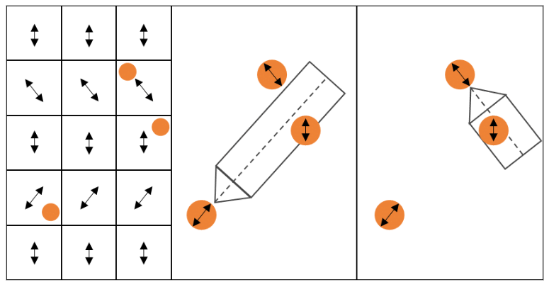
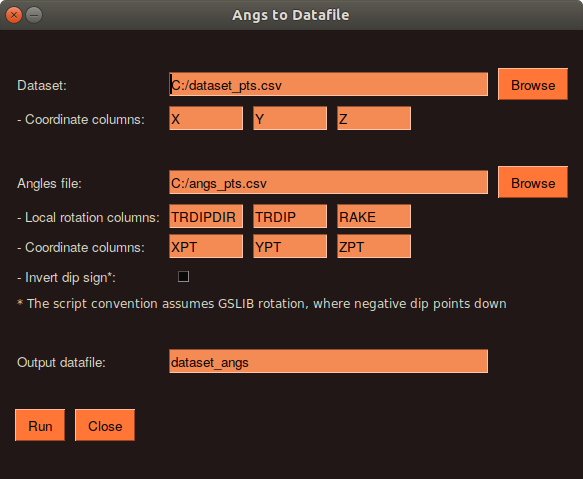
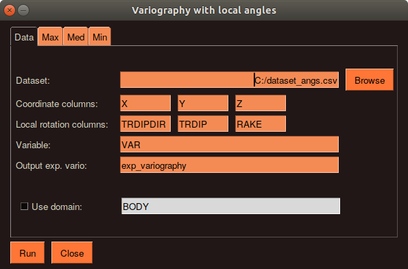
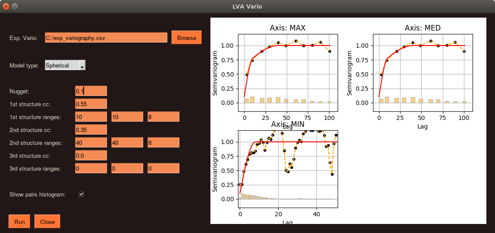

# Variography with local directions

This repository consists of a couple of Python scripts to perform variography with local directions. It is designed for the following situation:

* A dataset is available for spatial analysis and local anisotropies are known for the domain
* This script assign the local anisotropies (informed as 3-D ellipsoid rotation angles) to the samples and use them to make the experimental variography along the three main axes
* A model is fitted to the experimental points

The main difference of this approach is that the angular tolerances for experimental variography vary locally according to the local anisotropies directions. The sketch below illustrates the workflow, where the orange points are the samples for variography:

<p align="center">
  
</p>

## Installation

This is not a Python library, so the repository files just needs to be downloaded and saved in the same folder. But before running it, some dependencies must be installed. First of all, Python 3 should be installed (see [here](https://www.python.org/downloads/)). Then the following libraries must be installed:

```
pip install numpy pandas scikit-learn matplotlib PySimpleGUI
```

## Usage

The script is divided in three parts:

* `01_angles_to_data.py`: pass the local angles to the samples
* `02_exp_vario.py`: calculate experimental correlograms
* `03_model_vario.py`: fit a model to the experimental points

The 4th file `lva_vario_funcs.py` has some internal functions used for the three main process. Each one of the three modules has its own graphic interface and the respective instructions of what is necessary to input.

In Windows, the script should run only by double-clicking the `.py` file. If it does not work, it is recommended to run the scripts using the terminal. Open the terminal in the folder with the repository files and run one of the desired Python scripts:

```bash
py 01_angles_to_data.py
py 02_exp_vario.py
py 03_model_vario.py
```

The graphic interface will open and the required information must be informed.

<p align="center">
  
</p>

<p align="center">
  
</p>

<p align="center">
  
</p>

## Extra information

* Jupyter notebooks may fail to load the graphic interface. Running from terminal is recommended.
* Ellipsoid rotation is based on the GSLIB convention (see [here](http://www.ccgalberta.com/ccgresources/report06/2004-403-angle_rotations.pdf))
* The variography is made using correlograms. But they are plotted upside down to look like variograms.
